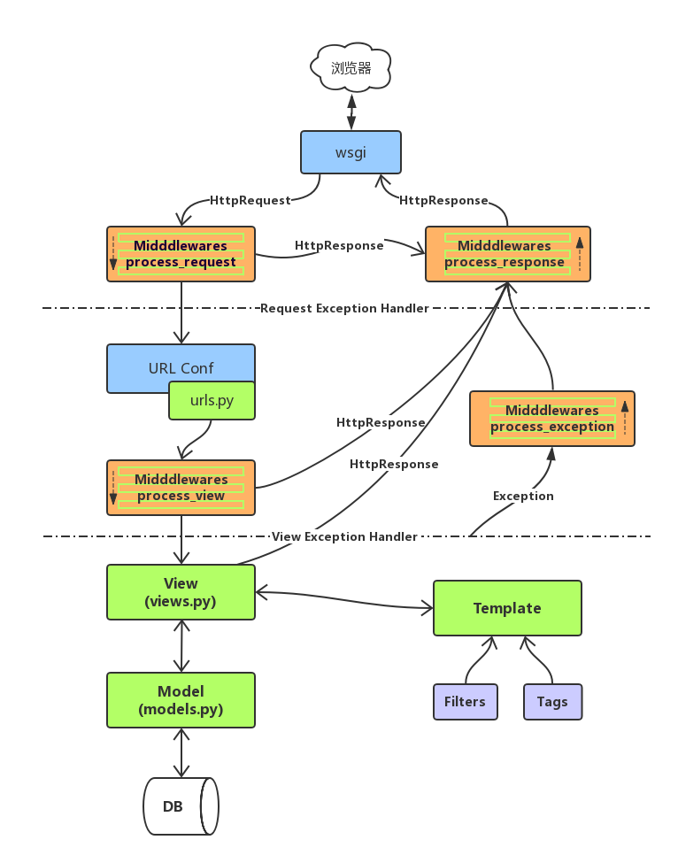

## 内容回顾

```python
from django.db import transaction

try:
    with transaction.atomic():
        # 事务 
        # 一系列的操作
        pass
    
except Exception as  e:
    print(e)
```

cookie

cookie是什么？

​		保存在浏览器本地的一组组键值对

为什么要使用cookie？

​		Http协议是无状态协议，每次请求之间都是相互独立，没有办法保存状态。使用cookie保存状态。

特征：

1. 由服务器让浏览器进行设置的
2. 浏览器把键值对保存在本地，有权不保存
3. 下次访问时自动携带对应的cookie

django中操作cookie

```
# 设置cookie  响应头 Set-cookie
ret = HttpResponse('xx')
ret.set_cookie(key,value,max_age=5,path='/',)   # ret['Set-cookie'] = 'key:value;'
ret.set_signed_cookie(key,value,salt='',max_age=5,path='/',)
# max_age 超时时间 
# path  生效的路径

# 获取cookie    cookie的请求头
request.COOKIES  {}   [key]  .get(key)
request.get_signed_cookie(key,salt='',default='')

# 删除cookie   Set-cookie   key:''   max_age=0
ret = HttpResponse('xx')
ret.delete_cookie(key)

```


## session

​	保存在服务器上的一组组键值对，依赖于cookie使用

为什么要使用session？

	1.  cookie是保存在浏览器本地，不太安全
 	2.  浏览器会对cookie的大小和个数有一定限制的

django中操作session

```
# 设置session
request.session[key] = value
# 获取
request.session[key]   request.session.get(key)
# 删除 
del request.session[key]
request.session.pop(key)

# session_key
request.session.session_key


# 将所有Session失效日期小于当前日期的数据删除
request.session.clear_expired()


# 删除当前用户的所有的session数据
request.session.delete()   # 不删除cookie
request.session.flush()	   # 删除cookie

# 设置会话Session和Cookie的超时时间
request.session.set_expiry(value)

```

配置

```
from django.conf import global_settings
```

```
SESSION_COOKIE_NAME = 'session'
SESSION_COOKIE_AGE = 60 * 60 * 24 * 7 * 2
SESSION_SAVE_EVERY_REQUEST = True  # 每次请求后更新超时时间
SESSION_EXPIRE_AT_BROWSER_CLOSE = True  # 关闭浏览器cookie就失效
SESSION_ENGINE = 'django.contrib.sessions.backends.db'
# session 保存的位置
# 默认是数据库  缓存  缓存+数据库 文件 加密cookie
from  django.contrib.sessions.backends import db
```

## 中间件

Django中处理请求和相应的框架级别的钩子。本质上就是一个类，类定义5个方法，特定时执行这些方法。

5个方法，4个特征

执行时间   执行顺序  参数   返回值  

### process_request(self, request)

执行时间： 视图函数之前

参数：	

​		request  请求的对象  和 视图函数是同一个对象

执行顺序： 

​		按照注册的顺序  顺序执行

返回值：

​		None  正常流程

​		HttpResponse  不执行后续的中间件的**process_request、路由匹配、process_view、视图**都不执行，直接执行当前中间的process_response方法

### process_response(self, request, response)

执行时间： 视图函数之后

参数：	

​		request  请求的对象  和 视图函数是同一个对象

​		response  响应对象

执行顺序： 

​		按照注册的顺序  倒序执行

返回值：

​		HttpResponse  必须返回

### process_view(self, request, view_func, view_args, view_kwargs)

执行时间： 路由匹配之后，视图函数之前

参数：	

​		request  请求的对象  和 视图函数是同一个对象

​		view_func  视图函数

​		view_args   视图函数的位置参数

​		view_kwargs  视图函数的关键字参数

执行顺序： 

​		按照注册的顺序  顺序执行

返回值：

​		None   正常流程

​		HttpResponse  之后中间件的process_view、视图都不执行，执行最后一个中间件的process_response方法

### process_exception(self, request, exception)

执行时间（触发条件）： 视图中有异常才执行

参数：	

​		request  请求的对象  和 视图函数是同一个对象

​		exception  异常的对象

执行顺序： 

​		按照注册的顺序  倒序执行

返回值：

​		None   当前的中间件没有处理异常，交给下一个中间件处理异常，如果都没有处理异常，django处理异常

​		HttpResponse  当前中间件处理了异常，后面的中间件的process_exception就不执行，执行最后一个中间件的process_response方法

### process_template_response(self,request,response)

执行时间（触发条件）： 视图中返回的对象是TemplateResponse对象

参数：	

​		request  请求的对象  和 视图函数是同一个对象

​		response  TemplateResponse的对象

执行顺序： 

​		按照注册的顺序  倒序执行

返回值：

​		HttpResponse TemplateResponse的对象  

​		过程处理模板的名字  参数 		

​		response.template_name
​		response.context_data

## django请求的生命周期




